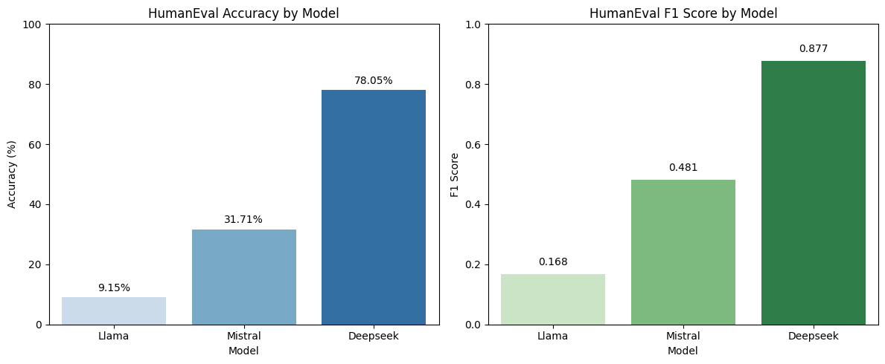

# Benchmark de LLM open source : LLaMA 2, Mistral et DeepSeek-R1

Évaluation comparative de trois modèles de langue de 7 milliards de paramètres sur le **raisonnement mathématique**, le **sens commun** et la **génération de code**. Projet réalisé dans le cadre du TER du Master 1 DCI (Université Paris Cité, 2025).

| Modèle | Éditeur | Particularité |
|---|---|---|
| `llama2:7b` | Meta AI | decoder-only, 2 000 milliards de tokens d'entraînement |
| `mistral:7b` | Mistral AI | decoder-only, réputé facile à fine-tuner |
| `deepseek-r1` (7B) | DeepSeek AI | distillation de DeepSeek-R1 dans Qwen, orienté raisonnement |

Les modèles sont servis localement avec **[Ollama](https://ollama.com)** sur des GPU Kaggle ; chaque notebook installe Ollama, télécharge les modèles, interroge chaque question et sauvegarde les réponses brutes et extraites en CSV.

## Benchmarks et protocole

| Benchmark | Tâche | Données | Protocole | Métrique |
|---|---|---|---|---|
| **GSM8K** | problèmes de maths niveau collège | 500 questions du test (`openai/gsm8k`) | 8-shot (exemples tirés du train), extraction de la réponse numérique finale | accuracy, F1 |
| **HellaSwag** | choisir la fin la plus logique parmi 4 | 500 questions de validation | 0-shot, le modèle renvoie l'index 0–3 | accuracy, F1 pondéré |
| **HumanEval** | compléter une fonction Python | 164 problèmes | 0-shot, code exécuté dans un processus isolé contre les tests unitaires | pass@1 |

## Résultats

| Modèle | GSM8K | HellaSwag | HumanEval (pass@1) |
|---|---:|---:|---:|
| LLaMA 2 7B | 5,0 % | 24,1 % | 9,1 % |
| Mistral 7B | 44,0 % | **61,2 %** | 31,7 % |
| DeepSeek-R1 7B | **47,6 %** | 51,8 % | **78,0 %** |

- **DeepSeek-R1** domine la génération de code et, quand il répond, il est très fiable en mathématiques (92 % de bonnes réponses parmi ses réponses exploitables). Mais son raisonnement long fait qu'il n'a produit une réponse exploitable que pour 258 questions GSM8K sur 500, et son temps d'inférence est **~100 fois plus élevé** que celui des deux autres modèles.
- **Mistral** est le meilleur compromis précision/latence et le plus fort en sens commun.
- **LLaMA 2** reste loin derrière sur les trois tâches.



L'analyse détaillée (types d'erreurs Python sur HumanEval, temps d'inférence, limites) est dans le [rapport](docs/rapport_TER.pdf).

## Contenu

```
comparaison.ipynb        # calcul des métriques et figures à partir des CSV
gsm8k/                   # notebook d'inférence + réponses des 3 modèles
hellaswag/               # idem
humaneval/               # idem, avec exécution sandboxée des solutions
figures/                 # graphiques de résultats
docs/rapport_TER.pdf     # rapport complet
```

## Reproduire

1. Ouvrir un notebook de benchmark (`gsm8k/`, `hellaswag/`, `humaneval/`) sur Kaggle avec un GPU et Internet activés, puis l'exécuter : il installe Ollama et télécharge les modèles.
2. Récupérer les CSV produits, puis exécuter `comparaison.ipynb` en local :

```bash
pip install pandas numpy scikit-learn matplotlib seaborn jupyter
jupyter notebook comparaison.ipynb
```

## Licence

Code distribué sous [licence MIT](LICENSE).

## Auteurs

**Amar Merabti** et **Lynda Hammouche** — TER encadré par Mohamed Bouadi, Master 1 Données, Connaissances et Intelligence, Université Paris Cité.
